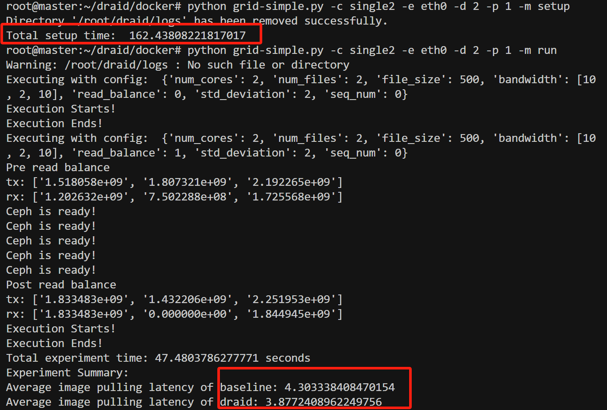

# draid

## Requirements
You shold have deployed a customized Ceph cluster according to `deploy/README.md`.

## Experiment



Note: You need to setup once each time before running the test.

**The setup time is around 2 minutes and the test time is around 1 minutes.**

0. Change the directory to `docker`.

```bash
cd docker
```

1. Run the script to setup the test environment on **master node**. Use `-v` to print the verbose output.

```bash
python grid-simple.py -c single2 -e eth0 -d 2 -p 1 -m setup
```

2. Run the script to run the test. Use `-v` to print the verbose output.

```bash
python grid-simple.py -c single2 -e eth0 -d 2 -p 1 -m run
```

## Deploy a normal functioning Ceph cluster

**Note: This is the prerequisite for Bowen Su's experiment.**
1. Run the script to setup the test environment on **master node**. Use `-v` to print the verbose output.
```bash
python grid-simple.py -c common -e eth0 -d 2 -p 1 -m setup
```

2. Cleanup the Ceph cluster.
```bash
./cleanup.sh
```


